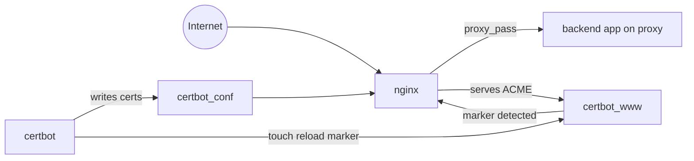

# Nginx Docker Reverse Proxy

[](https://github.com/taygumus/nginx-docker-reverse-proxy/actions/workflows/ci-lint.yml)
[](https://github.com/taygumus/nginx-docker-reverse-proxy/tags)


Production-ready Nginx reverse proxy for Docker Compose with automatic Let's
Encrypt HTTPS and Certbot renewals.

This project sits in front of application services, secures public traffic with
automatic HTTPS certificates, and routes each request to the correct backend
service. It is designed to stay explicit, reliable, and easy to operate in
production.

## Table of Contents

- [Overview](#overview)
- [Quick Start](#quick-start)
- [Configuration Reference](#configuration-reference)
- [Operational Commands](#operational-commands)
- [Add New Domain/App](#add-new-domainapp)
- [Validation Checklist](#validation-checklist)
- [Troubleshooting](#troubleshooting)
- [Architecture](#architecture)
- [Certificate Lifecycle](#certificate-lifecycle)
- [Companion Stack](#companion-stack)
- [CI Quality Gates](#ci-quality-gates)

## Overview

Why this repository exists:

- keep reverse proxy behavior explicit and auditable
- bootstrap HTTPS safely even before real certificates are issued
- automate renewal and trigger Nginx reload without container restarts
- provide a reusable edge layer for Dockerized apps on a shared external network

Best fit:

- explicit Nginx configuration control is preferred (not auto-generated routing)
- one or more app stacks run behind a single public entrypoint
- a simple, production-focused TLS edge for Compose is required

## Quick Start

### Prerequisites

- Docker Engine + Docker Compose
- Public DNS records pointing to this host
- Ports `80` and `443` reachable from the internet
- GNU Make (recommended for the command shortcuts)

### 1. Prepare local files

```sh
git clone https://github.com/taygumus/nginx-docker-reverse-proxy.git
cd nginx-docker-reverse-proxy
cp .env.example .env
cp nginx/default.conf.example nginx/default.conf
```

PowerShell note: if `cp` is unavailable, use `Copy-Item`.

### 2. Configure environment variables

Edit `.env` and set at least:

- `DOMAINS` (space-separated primary domains)
- `LETSENCRYPT_EMAIL`

Example:

```dotenv
DOMAINS=example.com api.example.com
LETSENCRYPT_EMAIL=admin@example.com
```

### 3. Configure Nginx reverse proxy blocks

Edit `nginx/default.conf` and define one HTTPS `server` block per certificate.

Required checks:

- `server_name` includes all names for that certificate
- certificate path matches primary domain:
  `/etc/letsencrypt/live/<primary-domain>/...`
- `proxy_pass` points to a container hostname/alias reachable on network `proxy`

Example upstream:

```nginx
location / {
  proxy_pass http://my-app-nginx:80;
}
```

### 4. Start the stack

```sh
docker network create proxy
make up
```

If `proxy` already exists, Docker may print an "already exists" message. This is
safe and can be ignored.

### 5. Issue the first certificate

```sh
make certbot-first-issue CERT_SAN="example.com www.example.com"
```

Important:

- `CERT_SAN` is a command argument, not an `.env` variable
- the first name in `CERT_SAN` becomes the certificate name
- that name must match the Nginx certificate path

### 6. Validate renewal path

```sh
make certbot-dry-run
make logs
```

## Configuration Reference

Environment variables are sourced from [`.env.example`](.env.example).

| Variable | Required | Default | Description |
| :--- | :--- | :--- | :--- |
| `DOMAINS` | Yes | `example.com myproject.io anotherexample.me` | Space-separated domains used for dummy certificate bootstrap. |
| `LETSENCRYPT_EMAIL` | Yes | `admin@example.com` | Email for Let's Encrypt expiry notifications. |
| `CERTBOT_RENEW_INTERVAL` | No | `12h` | Interval between renewal checks. |
| `RELOAD_POLL_INTERVAL` | No | `10` | Seconds between Nginx reload marker checks. |
| `NGINX_CPUS` | No | `0.5` | Declared CPU limit for Nginx service. |
| `NGINX_MEM_LIMIT` | No | `128M` | Declared memory limit for Nginx service. |
| `CERTBOT_CPUS` | No | `0.5` | Declared CPU limit for Certbot service. |
| `CERTBOT_MEM_LIMIT` | No | `128M` | Declared memory limit for Certbot service. |
| `LOG_SIZE` | No | `10m` | Max size per rotated container log file. |
| `LOG_FILES` | No | `3` | Number of log files retained. |

## Operational Commands

| Command | Purpose |
| :--- | :--- |
| `make up` | Build and start Nginx + Certbot in detached mode. |
| `make down` | Stop the stack. |
| `make logs` | Follow logs from all services. |
| `make certbot-first-issue CERT_SAN="..."` | Issue or update one certificate set. |
| `make certbot-dry-run` | Simulate renewal with `certbot renew --dry-run`. |

## Add New Domain/App

Use this workflow whenever you onboard a new backend application.

1. Join the backend service to external network `proxy` and expose a stable
   hostname or alias.
2. Add a new HTTPS `server` block in `nginx/default.conf` with:
   - `server_name` containing the primary domain and SANs
   - `ssl_certificate` and `ssl_certificate_key` under
     `/etc/letsencrypt/live/<primary-domain>/...`
   - `proxy_pass` pointing to the backend hostname/alias on network `proxy`
3. Reload the stack configuration:

   ```sh
   make up
   ```

4. Issue the certificate with the same domain order used in `server_name`:

   ```sh
   make certbot-first-issue CERT_SAN="new.example.com www.new.example.com"
   ```

5. Verify logs and renewal path:

   ```sh
   make logs
   make certbot-dry-run
   ```

## Validation Checklist

After initial deployment (or after domain changes), validate these points:

- `docker compose ps` shows `nginx` and `certbot` as running.
- `docker compose exec nginx nginx -t` returns valid Nginx config.
- `make certbot-first-issue CERT_SAN="..."` completes without ACME errors.
- `make certbot-dry-run` completes successfully.
- `docker compose logs --tail=100 nginx certbot` shows:
  - certificate issuance/renewal success
  - reload marker consumption (`Nginx reloaded (marker consumed)`).

## Troubleshooting

| Symptom | Likely cause | What to check |
| :--- | :--- | :--- |
| HTTP-01 challenge fails (`unauthorized` or `404`) | DNS/port routing issue, or ACME location missing | Confirm A/AAAA records point to this host, ports `80/443` are open, and `/.well-known/acme-challenge/` location exists in HTTP block. |
| `cannot load certificate .../live/<domain>/fullchain.pem` | Primary certificate name mismatch | Ensure first domain in `CERT_SAN` matches `<domain>` used in Nginx cert paths. |
| Upstream host not found (`host not found in upstream`) | Backend service not reachable on `proxy` network | Confirm backend container joins external network `proxy` with the hostname/alias used in `proxy_pass`. |
| Renewal runs but Nginx still serves old cert | Reload marker not consumed | Check shared `certbot_www` volume mount and `30-nginx-reload-watcher.sh` logs in `nginx`. |

## Architecture



At runtime:

- Nginx and Certbot share `/etc/letsencrypt` through the `certbot_conf` volume
- Nginx and Certbot share the ACME webroot and reload marker through the
  `certbot_www` volume
- application stacks share traffic with this proxy through the external
  Docker network `proxy`

## Certificate Lifecycle

1. Nginx starts and mounts shared cert/webroot volumes.
2. Entry scripts create and link temporary dummy certificates for domains in
   `DOMAINS`.
3. Certbot obtains real certificates via HTTP-01 challenge.
4. Certbot writes the reload marker file.
5. Nginx watcher detects the marker and runs `nginx -s reload`.
6. Periodic renewals repeat this mechanism automatically.

Implementation references:

- [`nginx/entrypoint/10-create-dummy-cert.sh`](nginx/entrypoint/10-create-dummy-cert.sh)
- [`nginx/entrypoint/20-setup-cert-links.sh`](nginx/entrypoint/20-setup-cert-links.sh)
- [`nginx/entrypoint/30-nginx-reload-watcher.sh`](nginx/entrypoint/30-nginx-reload-watcher.sh)
- [`certbot/certbot-first-issue/certbot-first-issue.sh`](certbot/certbot-first-issue/certbot-first-issue.sh)
- [`certbot/certbot-renew/certbot-renew.sh`](certbot/certbot-renew/certbot-renew.sh)

## Companion Stack

This proxy is designed to integrate cleanly with
[wp-docker-stack](https://github.com/taygumus/wp-docker-stack).

In its production profile, the WordPress stack publishes alias
`wp-docker-stack-nginx` on the same external `proxy` network, so the Nginx
upstream can be:

```nginx
proxy_pass http://wp-docker-stack-nginx:80;
```

## CI Quality Gates

The workflow in
[`.github/workflows/ci-lint.yml`](.github/workflows/ci-lint.yml) checks:

- shell scripts (`shellcheck`)
- compose YAML (`yamllint`)
- compose resolution (`docker compose config`)
- `Makefile` quality (`checkmake`)
- markdown linting (`markdownlint`)
