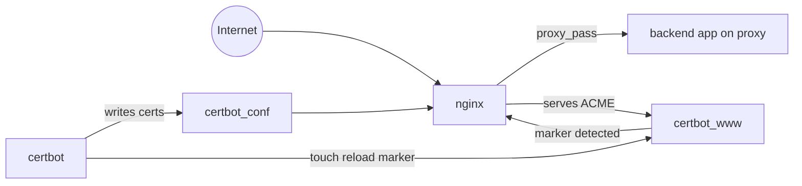

# Nginx Docker Reverse Proxy

[](https://github.com/taygumus/nginx-docker-reverse-proxy/actions/workflows/ci-lint.yml)

[](https://github.com/taygumus/wp-docker-stack)

Production-ready Nginx + Certbot reverse proxy for Docker Compose
deployments.

This repository exposes one or more containerized applications on a shared
Docker network, terminates TLS with Let's Encrypt, and keeps certificates fresh
with automatic renewal plus Nginx hot reload.

It is especially useful as the public edge layer in front of companion stacks
such as [wp-docker-stack](https://github.com/taygumus/wp-docker-stack), but it
works with any backend reachable through Docker DNS on the same external
network.

## TL;DR

1. Copy the templates:

   ```sh
   cp .env.example .env
   cp nginx/default.conf.example nginx/default.conf
   ```

2. Edit `.env` and set `DOMAINS` plus `LETSENCRYPT_EMAIL`.
3. Edit `nginx/default.conf` and set `server_name`, certificate paths, and
   `proxy_pass`.
4. Create the shared network:

   ```sh
   docker network create proxy
   ```

5. Start the stack:

   ```sh
   make up
   ```

6. Issue the first certificate:

   ```sh
   make certbot-first-issue CERT_SAN="example.com www.example.com"
   ```

7. Open `https://example.com`.

Important: `DOMAINS` should contain the primary certificate names only, while
`CERT_SAN` contains the full Subject Alternative Name list for one
certificate.

## Table of Contents

- [Overview](#overview)
- [Why This Repository](#why-this-repository)
- [Prerequisites](#prerequisites)
- [Detailed Quick Start](#detailed-quick-start)
- [First-Issue Checklist](#first-issue-checklist)
- [Use It with wp-docker-stack](#use-it-with-wp-docker-stack)
- [Configuration](#configuration)
- [Operational Commands](#operational-commands)
- [Certificate Lifecycle](#certificate-lifecycle)
- [Architecture](#architecture)
- [Repository Layout](#repository-layout)
- [CI and Quality Gates](#ci-and-quality-gates)
- [Contributing](#contributing)

## Overview

This project provides a small, explicit edge layer for Docker Compose
environments.

Instead of relying on automatic service discovery, you keep full control of the
public routing layer in
[`nginx/default.conf.example`](nginx/default.conf.example) while Certbot
handles certificate issuance and renewal through the HTTP-01 webroot challenge.

The repository is built around two long-running services:

- `nginx` serves ports `80` and `443`, proxies requests to upstream containers,
  serves the ACME challenge directory, and reloads itself when certificates
  change.
- `certbot` runs a renewal loop and shares certificate state plus ACME webroot
  data with Nginx.

## Why This Repository

- Explicit Nginx configuration. Routing stays readable, reviewable, and easy to
  reason about.
- Safe TLS bootstrap. Dummy certificates let Nginx start before real
  certificates exist.
- Automatic renewals. Certbot renews certificates in the background without
  manual intervention.
- Hot reload on change. Nginx reloads when a certificate is issued or renewed,
  without a full container restart.
- Clean Compose integration. Any backend stack attached to the same external
  `proxy` network can become an upstream.

## Prerequisites

- Docker Engine
- Docker Compose v2
- GNU Make is recommended but optional
- A public DNS record pointing your domain to the host that runs this stack
- Ports `80` and `443` reachable from the internet
- A shared external Docker network named `proxy`
- At least one backend service attached to `proxy` with a stable hostname or
  network alias

Commands in this README use a POSIX-like shell.

If you work in PowerShell, replace `cp` with `Copy-Item`.

## Detailed Quick Start

### 1. Clone the repository

```sh
git clone https://github.com/taygumus/nginx-docker-reverse-proxy.git
cd nginx-docker-reverse-proxy
```

### 2. Create local configuration files

```sh
cp .env.example .env
cp nginx/default.conf.example nginx/default.conf
```

The real `.env` file and `nginx/default.conf` are gitignored on purpose, so you
can keep deployment-specific values outside version control.

### 3. Configure `.env`

Open [`.env.example`](.env.example) as a reference and set at least:

- `DOMAINS`: space-separated list of primary certificate names
- `LETSENCRYPT_EMAIL`: email used by Let's Encrypt for expiry notices

Example:

```dotenv
DOMAINS=example.com api.example.com
LETSENCRYPT_EMAIL=admin@example.com
```

### 4. Configure `nginx/default.conf`

Start from
[`nginx/default.conf.example`](nginx/default.conf.example) and adjust the HTTPS
server blocks for your real applications.

For each certificate:

- create one HTTPS `server` block
- set `server_name` to the primary domain plus all SANs
- point `ssl_certificate` and `ssl_certificate_key` to the primary domain's
  live directory
- set `proxy_pass` to the upstream hostname or alias on network `proxy`

Example:

```nginx
server {
  listen 443 ssl;
  http2 on;
  server_name example.com www.example.com;

  ssl_certificate     /etc/letsencrypt/live/example.com/fullchain.pem;
  ssl_certificate_key /etc/letsencrypt/live/example.com/privkey.pem;

  location / {
    proxy_pass http://example-app:80;

    proxy_set_header Host $host;
    proxy_set_header X-Real-IP $remote_addr;
    proxy_set_header X-Forwarded-For $proxy_add_x_forwarded_for;
    proxy_set_header X-Forwarded-Proto https;
  }
}
```

The HTTP block that serves `/.well-known/acme-challenge/` and redirects to HTTPS
usually does not need to change.

### 5. Create the shared network

```sh
docker network create proxy
```

If the network already exists, Docker will report it and you can continue.

### 6. Start the stack

```sh
make up
```

Equivalent raw Compose command:

```sh
docker compose up -d --build
```

### 7. Issue the first certificate

Run the first-issue command once for each certificate you want to create:

```sh
make certbot-first-issue CERT_SAN="example.com www.example.com"
```

Key rule: the first hostname in `CERT_SAN` becomes the certificate name and the
directory under `/etc/letsencrypt/live/<name>/`.

That first hostname must match:

- the certificate path used in `nginx/default.conf`
- one of the entries in `DOMAINS`

### 8. Validate renewal behavior

Optional but recommended:

```sh
make certbot-dry-run
```

### 9. Inspect logs

```sh
make logs
```

## First-Issue Checklist

Before running `certbot-first-issue`, verify these points:

- your domain already resolves publicly to the host that runs this stack
- port `80` is reachable from the internet for the HTTP-01 challenge
- `make up` has already started Nginx
- `nginx/default.conf` already references the same primary domain used in
  `CERT_SAN`
- the upstream container is attached to network `proxy`

## Use It with wp-docker-stack

This repository is a natural public edge in front of
[wp-docker-stack](https://github.com/taygumus/wp-docker-stack).

The production profile of `wp-docker-stack` exposes its internal Nginx service
on the external `proxy` network with alias `wp-docker-stack-nginx`.

That means your reverse proxy block can target it directly:

```nginx
server {
  listen 443 ssl;
  http2 on;
  server_name blog.example.com www.blog.example.com;

  ssl_certificate     /etc/letsencrypt/live/blog.example.com/fullchain.pem;
  ssl_certificate_key /etc/letsencrypt/live/blog.example.com/privkey.pem;

  location / {
    proxy_pass http://wp-docker-stack-nginx:80;

    proxy_set_header Host $host;
    proxy_set_header X-Real-IP $remote_addr;
    proxy_set_header X-Forwarded-For $proxy_add_x_forwarded_for;
    proxy_set_header X-Forwarded-Proto https;
  }
}
```

Typical flow:

1. Start `wp-docker-stack` in production mode.
2. Make sure both repositories use the same external `proxy` network.
3. Point this reverse proxy at `wp-docker-stack-nginx:80`.
4. Issue the certificate with:

   ```sh
   make certbot-first-issue \
     CERT_SAN="blog.example.com www.blog.example.com"
   ```

## Configuration

### Environment variables

Required variables:

- `DOMAINS`: space-separated list of primary certificate names used for dummy
  certificate bootstrap and symlink setup
- `LETSENCRYPT_EMAIL`: Let's Encrypt contact email

Optional variables:

- `CERTBOT_RENEW_INTERVAL`: how often Certbot checks for renewals
  (default: `12h`)
- `RELOAD_POLL_INTERVAL`: how often Nginx checks for the reload marker file
  (default: `10`)
- `NGINX_CPUS`, `NGINX_MEM_LIMIT`: declared resource limits for `nginx`
- `CERTBOT_CPUS`, `CERTBOT_MEM_LIMIT`: declared resource limits for `certbot`
- `LOG_SIZE`, `LOG_FILES`: container log rotation settings

See [`.env.example`](.env.example) for the full reference.

### Domain naming rules

`DOMAINS` and `CERT_SAN` solve different problems:

- `DOMAINS` tells Nginx which primary domain directories need dummy
  certificates at startup.
- `CERT_SAN` tells Certbot which names belong to one real certificate.
- The first entry in `CERT_SAN` is the certificate name.
- Your `ssl_certificate` path must use that same primary name.

Example:

- `DOMAINS=example.com api.example.com`
- `CERT_SAN="example.com www.example.com"`
- `CERT_SAN="api.example.com"`

### Nginx configuration rules

- Keep the HTTP server block dedicated to ACME challenge handling and HTTPS
  redirection.
- Use one HTTPS server block per certificate.
- Make sure the primary domain used in
  `/etc/letsencrypt/live/<primary-domain>/` also appears in `server_name`.
- Use a Docker hostname or network alias in `proxy_pass`, not `localhost`.
- Keep `nginx/default.conf` deployment-specific. The repository ships the
  example file, not a one-size-fits-all production vhost.

## Operational Commands

`Makefile` is the main operator interface:

- `make up`: build and start the stack
- `make down`: stop the stack
- `make logs`: stream service logs
- `make certbot-first-issue CERT_SAN="example.com www.example.com"`:
  issue or update one certificate
- `make certbot-dry-run`: simulate renewal with `certbot renew --dry-run`

If you do not use `make`, you can run the first-issue command directly:

```sh
docker compose run --rm \
  --entrypoint sh \
  certbot \
  /certbot/certbot-first-issue/certbot-first-issue.sh \
  "example.com www.example.com"
```

## Certificate Lifecycle

The certificate workflow is intentionally explicit and easy to inspect:

1. Nginx starts first.
2. The entry script
   [`10-create-dummy-cert.sh`](nginx/entrypoint/10-create-dummy-cert.sh)
   creates one-day dummy certificates for the domains listed in `DOMAINS`.
3. The entry script
   [`20-setup-cert-links.sh`](nginx/entrypoint/20-setup-cert-links.sh)
   symlinks those dummy files into `/etc/letsencrypt/live/<domain>/` when a
   real certificate is not there yet.
4. Nginx can now boot successfully with TLS server blocks already enabled.
5. The one-off script
   [`certbot-first-issue.sh`](certbot/certbot-first-issue/certbot-first-issue.sh)
   requests the real certificate through the shared webroot.
6. When issuance succeeds, Certbot touches a reload marker file in the shared
   `certbot_www` volume.
7. The watcher
   [`30-nginx-reload-watcher.sh`](nginx/entrypoint/30-nginx-reload-watcher.sh)
   consumes the marker and reloads Nginx.
8. The long-running renewal service
   [`certbot-renew.sh`](certbot/certbot-renew/certbot-renew.sh)
   repeats `certbot renew` on a schedule and reuses the same reload hook.

## Architecture



At runtime:

- Nginx and Certbot share `/etc/letsencrypt` through the `certbot_conf` volume
- Nginx and Certbot share the ACME webroot and reload marker through the
  `certbot_www` volume
- your application stack shares traffic with this proxy through the external
  Docker network `proxy`

## Repository Layout

- [`docker-compose.yml`](docker-compose.yml): main service definition for Nginx,
  Certbot, shared volumes, and external network wiring
- [`Makefile`](Makefile): convenience commands for operators
- [`nginx/Dockerfile`](nginx/Dockerfile): Nginx image extension with `openssl`
  for dummy certificate creation
- [`nginx/default.conf.example`](nginx/default.conf.example): editable reverse
  proxy template
- [`nginx/entrypoint`](nginx/entrypoint): startup scripts for dummy certs,
  symlinks, and reload watching
- [`certbot/certbot-first-issue`](certbot/certbot-first-issue): one-off initial
  issuance logic
- [`certbot/certbot-renew`](certbot/certbot-renew): long-running renewal loop
- [`certbot/certbot-dry-run`](certbot/certbot-dry-run): renewal simulation
- [`.github/workflows/ci-lint.yml`](.github/workflows/ci-lint.yml): CI workflow
  for shell, Compose, Makefile, and Markdown checks

## CI and Quality Gates

The GitHub Actions workflow validates the repository with:

- `shellcheck` for shell scripts
- `yamllint` for Compose files
- `docker compose config` for Compose resolution
- `checkmake` for the `Makefile`
- `markdownlint` for Markdown files

This keeps the project friendly to both operators and contributors.

## Contributing

Issues and pull requests are welcome.

When proposing changes, please keep the project aligned with its core design:

- explicit Nginx routing instead of opaque auto-discovery
- script-driven operational behavior that stays easy to audit
- documentation updates when setup, certificates, or operator workflows change

If your change affects shell scripts, Compose structure, or Markdown, make sure
the CI checks still pass.
